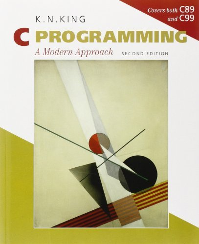

# Exercises and projects for the KNK (second edition)
This repo contains **my solutions** for the **exercises** and **projects** for the book **C Programming: A Modern Approach** by *K.N. King*, (second edition).

* [Chapter 02](ch02)
* [Chapter 03](ch03)
