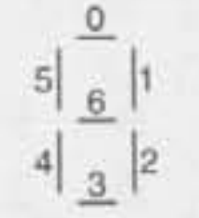

# Chapter 8: Exercises

## Exercise 1
We discussed using the expression `sizeof(a) / sizeof(a[0])` to calculate the number of elements in an array. The expression `sizeof(a) / sizeof(t)`, where `t` is the type of ``a``'s elements, would also work, but it's considered an inferior technique. Why?

**Answer**: If we start with an **array of integers** and use as **denominator** `sizeof(int)`, but further on, we decide to **change the type of the array** to, for example, ``long`` instead of ``int``, then we should also would have to change each instance of the expression ``sizeof(int)`` to ``sizeof(long)``.

The expression `sizeof(a[0])` will always return the type of the **first element**, regardless of what is the type of the whole array. That way, if we change the type of the whole array, `sizeof(a[0])` will adapt automatically whithout the need of editing it.

## Exercise 2
The Q&A section shows how to use a letter as an array subscript. Describe how to use a digit (in character form) as a subscript.

**Answer**: Let's imagine that we have the declaration:
```c
char c = '5';
```

If we subtract the character `'0'` from it, we get the **integer value** `5`, that can be used as array index:

```c
/* The following expression is true */
digit_count[c - '0'] == digit_count[5];
```

## Exercise 3
Write a declaration of an array named ``weekend`` containing seven ``bool`` values. Include an **initializer** that makes the first and last values ``true``; all other values should be ``false``.

**Answer**: Check ``ex03.c``, but basically it boils down to:

```c
int weekend[7] = {1, 0, 0, 0, 0, 0, 1};
```

## Exercise 4
(C99) Repeat Exercise 3, but this time use a **designated initializer**. Make the initializer as short as possible.

**Answer**: Check ``ex04.c``, but basically it boils down to:

```c
bool weekend[7] = {[0] = true, [6] = true};
```

## Exercise 5
The Fibonacci numbers are 0, 1, 1, 2, 3, 5, 8, 13, ..., where each number is the sum of the two preceding numbers. Write a program fragment that declares an array named ``fib_numbers`` of length 40 and fills the array with the first 40 Fibonacci numbers. Hint: Fill in the first two numbers individually, then use a loop to compute the remaining numbers.

**Answer**: Check ``ex05.c``.

## Exercise 6
Calculators, watches and other electronic devices often rely on seven-segment displays for numerical output. To form a digit, such devices "turn on" some of the seven segments while leaving others "off":

```
 _        _    _         _    _    _    _    _ 
| |   |   _|   _|  |_|  |_   |_     |  |_|  |_|
|_|   |  |_    _|    |   _|  |_|    |  |_|   _|
```

Suppose that we want to set up an array that remembers which segments should be "on" for each digit. Let's number the segments as follows:



Here's what the array might look like, with each row representing one digit:

```c
const int segments[10][7] = {{1, 1, 1, 1, 1, 1, 0}, ...};
```

I've given you the first row of the initializer; fill in the rest.

**Answer**: Check ``ex06.c``.

## Exercise 7
Using the shortcuts described in Section 8.2, shrink the initializer for the segments array (Exercise 6) as much as you can.

**Answer**: Check ``ex07.c``.

```c
const int segments[10][7] = {{1, 1, 1, 1, 1, 1},
                             {0, 1, 1},
                             {1, 1, 0, 1, 1, 0, 1},
                             {1, 1, 1, 1, 0, 0, 1},
                             {0, 1, 1, 0, 0, 1, 1},
                             {1, 0, 1, 1, 0, 1, 1},
                             {1, 0, 1, 1, 1, 1, 1},
                             {1, 1, 1},
                             {1, 1, 1, 1, 1, 1, 1},
                             {1, 1, 1, 1, 0, 1, 1}};

```

## Exercise 8
Write a declaration for a two-dimensional array named temperature_readings that stores one month of hourly temperature readings. (For simplicity, assume that a month has 30 days.) The rows of the array should represent days of the month; the colums should represent hours of the day.

**Answer**: Check ``ex08.c`` to see it in action. Basically the declaration is as follows:
```c
double temperature_readings[30][24] = {0};
```

## Exercise 9
Using the array of Exercise 8, write a program fragment that computes the average temperature for a month (averaged over all days of the month and all hours of the day).

**Answer**: Check ``ex09.c``.

## Exercise 10
Write a declaration for an 8 x 8 char array named chess_board. Include an initializer that puts the following data into the array ( on character per array element):
```
r n b q k b n r
p p p p p p p p
  .   .   .   .
.   .   .   .
  .   .   .   .
.   .   .   .
P P P P P P P P
R N B Q K B N R
```

**Answer**: Check ``ex10.c``.

## Exercise 11
Write a program fragment that declares an 8 x 8 char array named checker_board and then uses a loop to store the following data into the array (one character per array element):

```
B R B R B R B R
R B R B R B R B
B R B R B R B R
R B R B R B R B
B R B R B R B R
R B R B R B R B
B R B R B R B R
R B R B R B R B
```

*Hint*: The element in row ``i``, column ``j``, should be the letter ``B`` if ``i + j`` is an even number.

**Answer**: Check ``ex11.c``.
